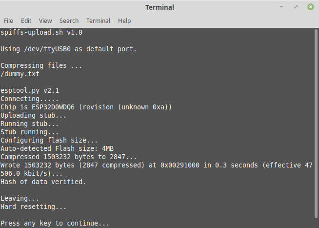
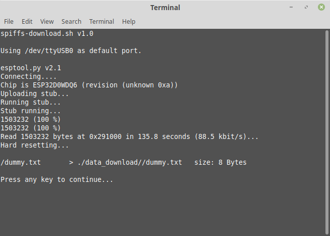

# esp32-SPIFFS-Extracter

This project contains three different scripts to write files to the [SPIFFS](https://techtutorialsx.com/2019/02/23/esp32-arduino-list-all-files-in-the-spiffs-file-system/) of the ESP32, to download files from the SPIFFS or even to erase the whole flash memory.

## Usage

Make sure, that the executable bits from the files ```esptool.py```, ```mkspiffs``` and all the shell scripts ```*.sh``` are set.

### Uploading data

To upload files to the internal memory of the ESP32 (so called SPIFFS), just put the files you wanna upload into the directory ```/data_upload``` and execute the script ```spiffs-upload.sh```. If you don't specify a port, the script will use the first connected ```/dev/ttyUSB*``` device. Otherwise specify the device with calling the script with e.g. ```spiffs-upload.sh /dev/ttyUSB1```.

<p align="center"></img></p>

### Downloading data

To download files from the internal memory of the ESP32 to your computer, execute the script ```spiffs-download.sh```. If you don't specify a port, the script will use the first connected ```/dev/ttyUSB*``` device. Otherwise specify the device with calling the script with e.g. ```spiffs-download.sh /dev/ttyUSB1```.

<p align="center"></img></p>

### Erasing the flash memory

To erase the complete memory, just execute the script ```spiffs-erase.sh```. To specify the device, call the script like mentioned in the examples above.
